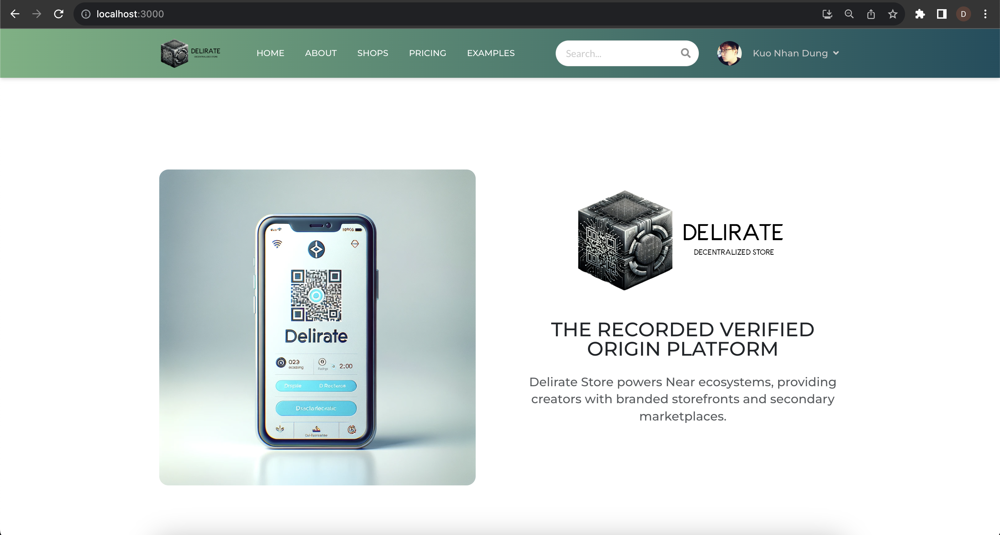

<!-- ABOUT THE PROJECT -->
## About The Project

Client website where customer of Delirate can go shopping. Besides, organizations plan to make own landing website or online stores. 



<iframe src="https://player.vimeo.com/video/890052981?h=fb471474c9" width="640" height="360" frameborder="0" allow="autoplay; fullscreen; picture-in-picture" allowfullscreen></iframe>
<p><a href="https://vimeo.com/890052981">Delirate Intro</a> from <a href="https://vimeo.com/user212008353">Dung Kuo Nhan</a> on <a href="https://vimeo.com">Vimeo</a>.</p>

### Built With

To run this project, make sure that your environment have all of these frameworks/libraries:

* [![React][React.js]][React-url]
* [![NodeJs][Node.js]][Node-url]
* [![MDBootstrap][MDBootstrap.js]][MDBootstrap-url]


### Installation

1. Clone the repo
   ```sh
   git clone https://github.com/keysKuo/ReactJs-Delirate-Frontend.git
   ```
2. Install NPM packages
   ```sh
   npm install
   ```
3. Config your IPV4 Address as your API_URL `.env`

   ```js
   API_URL = [Your IP Address]
   ```
4. Run the source code
   ```sh
   npm start
   ```


<!-- MARKDOWN LINKS & IMAGES -->
<!-- https://www.markdownguide.org/basic-syntax/#reference-style-links -->
[contributors-shield]: https://img.shields.io/github/contributors/othneildrew/Best-README-Template.svg?style=for-the-badge
[contributors-url]: https://github.com/othneildrew/Best-README-Template/graphs/contributors
[forks-shield]: https://img.shields.io/github/forks/othneildrew/Best-README-Template.svg?style=for-the-badge
[forks-url]: https://github.com/othneildrew/Best-README-Template/network/members
[stars-shield]: https://img.shields.io/github/stars/othneildrew/Best-README-Template.svg?style=for-the-badge
[stars-url]: https://github.com/othneildrew/Best-README-Template/stargazers
[issues-shield]: https://img.shields.io/github/issues/othneildrew/Best-README-Template.svg?style=for-the-badge
[issues-url]: https://github.com/othneildrew/Best-README-Template/issues
[license-shield]: https://img.shields.io/github/license/othneildrew/Best-README-Template.svg?style=for-the-badge
[license-url]: https://github.com/othneildrew/Best-README-Template/blob/master/LICENSE.txt
[linkedin-shield]: https://img.shields.io/badge/-LinkedIn-black.svg?style=for-the-badge&logo=linkedin&colorB=555
[linkedin-url]: https://linkedin.com/in/othneildrew
[product-screenshot]: images/screenshot.png
[Node.js]: https://img.shields.io/badge/node.js-6DA55F?style=for-the-badge&logo=node.js&logoColor=white
[Node-url]: https://nodejs.org/
[React.js]: https://img.shields.io/badge/React-20232A?style=for-the-badge&logo=react&logoColor=61DAFB
[React-url]: https://reactjs.org/
[MDBootstrap.js]: https://img.shields.io/badge/bootstrap-%238511FA.svg?style=for-the-badge&logo=bootstrap&logoColor=white
[MDBootstrap-url]: https://mdbootstrap.com/
